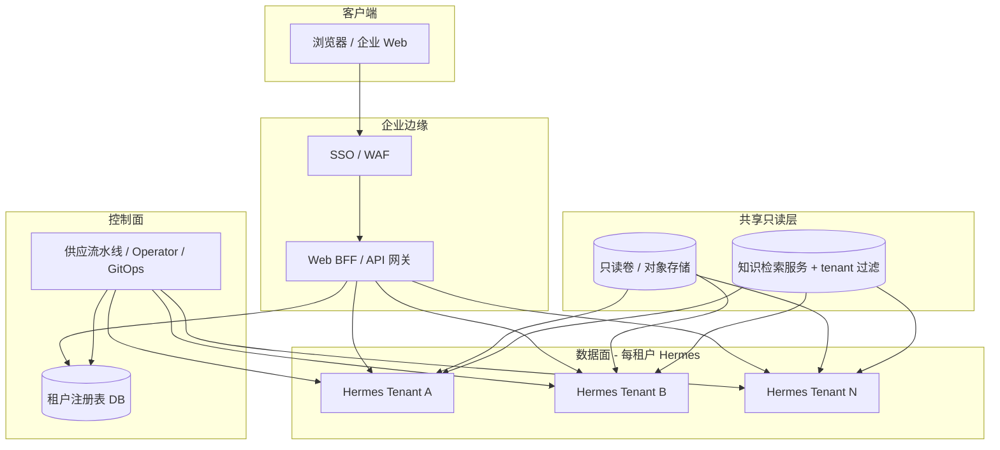

# Hermes-agent 企业多租户 Web 架构设计

**版本**：1.3  
**状态**：设计说明（Design）  
**适用场景**：用户主要从 **Web** 进入；**同一模型**；以 **数据隔离** 为主；租户（组）数量 **可动态增减**。

**配置与部署落地步骤**（环境变量、PVC、探针、BFF 约定等）见 companion 文档：[`enterprise-multi-tenant-deploy-and-config.md`](./enterprise-multi-tenant-deploy-and-config.md)。

**从 0 自研聊天系统并将 Hermes 作为 Bot 接入**（人↔人 + 人↔Hermes 统一聊天）见：[`enterprise-chat-system-with-hermes-bot.md`](./enterprise-chat-system-with-hermes-bot.md)。

---

## 1. 文档目的与读者

本文档汇总 Hermes-agent 在大型企业中的一套 **推荐架构**：在复用 Hermes 既有能力（profile、`HERMES_HOME`、API Server 等）的前提下，通过 **Web 网关层 + 租户控制面 + 每租户独立运行时** 实现多组隔离与弹性扩缩租户数量。

**读者**：架构师、平台工程、安全与合规、后端负责人。

---

## 2. 设计目标与非目标

### 2.1 目标

| 目标 | 说明 |
|------|------|
| **Web 为主入口** | 企业门户或自研 SPA 经 SSO 与 BFF 访问智能助手能力。 |
| **同一模型** | 各租户使用相同模型标识与推理端点配置；差异主要体现在数据与密钥策略。 |
| **数据隔离为主** | 会话、memory、可写配置与本地持久化 **按租户隔离**；禁止跨租户读写。 |
| **租户数量动态** | 新增/停用「组」不依赖固定 4 实例；通过 **租户注册表 + 自动化交付** 扩展。 |
| **可审计、可运维** | 身份、组切换、路由决策可追溯；支持备份与生命周期管理。 |

### 2.2 非目标（本设计不展开）

- 细粒度「同一租户内不同工具策略」的 RBAC 矩阵（可与本设计叠加，见第 11 节）。
- 修改 Hermes 内核实现「单进程原生多租户」（若未来需要，属独立立项）。
- 具体云厂商按钮级操作手册（仅给出 K8s 级模式）。

---

## 3. Hermes 相关概念（实施前必读）

### 3.1 Profile 与 `HERMES_HOME`

Hermes 通过 **`HERMES_HOME`** 指向的根目录实现 **profile（配置档）** 级隔离：

- 默认：`~/.hermes`
- 命名 profile：`~/.hermes/profiles/<name>/`（由 CLI `hermes profile` 管理）

每个 profile **独立** 拥有：`config.yaml`、`.env`、sessions、memory、skills、gateway、cron、logs 等。详见仓库内 `hermes_cli/profiles.py` 模块说明。

### 3.2 与「企业组」的映射

**企业中的一个「组」≈ 一个租户（tenant）≈ 一套独立的 `HERMES_HOME`（一个 Hermes 运行时实例或 StatefulSet）。**

Hermes 不包含「企业组」对象；**租户边界由部署与路由层实现**。

### 3.3 对外 API（Web 对接）

面向 OpenAI 兼容客户端的 **API Server** 与网关一同启动，典型路径如 `POST /v1/chat/completions`（客户端携带完整 `messages`）或 `POST /v1/responses`（服务端会话状态）。详见官方文档：`website/docs/user-guide/features/api-server.md`。

> 说明：仓库内 `web/` 目录下的仪表盘更偏 **单机/单 profile 运维与配置**，**不是**本设计中的多租户企业聊天前端；企业聊天 UI 建议自研或采购，经 BFF 调用各租户的 Hermes API。

---

## 4. 总体逻辑架构

**数据流要点**：

1. 用户经 SSO 登录；BFF 从令牌或服务端会话得到 **`tenant_id`**（与业务「组」一一对应）。
2. BFF 查询 **租户注册表**，解析该租户 Hermes 的 **内网 Base URL** 与 **鉴权信息**（引用密钥，不落明文）。
3. 请求 **仅** 转发到该租户 Hermes；流式 SSE 由 BFF 透传至浏览器。
4. **共享只读** 与 **知识检索** 可被所有租户读取，但知识查询 **必须** 带 `tenant_id` 过滤条件。

---

## 5. 数据分层

### 5.1 每租户独占（强隔离）

以下内容 **必须** 位于该租户专属存储（独立 PVC / 云盘目录），对应单一 `HERMES_HOME`：

- 会话存储、FTS 索引、本地 SQLite 等 Hermes 会话相关文件
- Memory、用户侧 skills 的可写副本、日志、gateway 状态等

**禁止** 多租户共写同一 `HERMES_HOME` 或同一 SQLite 文件，以避免锁、损坏与合规串数据。

### 5.2 全公司共享（只读 + 受控发布）

| 资源 | 建议形态 |
|------|----------|
| 标准 skills、制度 PDF、模板 | **只读** 挂载（同一镜像路径）或启动时从对象存储拉取只读层 |
| 企业知识库 | **检索服务**（向量库 / 搜索引擎），文档与索引带 **`tenant_id`**，查询在 **服务端强制过滤**；可选再叠加「角色」过滤 |
| 模型与路由配置 | **ConfigMap 模板** 全租户一致；密钥用 **每租户 Secret** 或统一推理网关 + 配额 |

### 5.3 密钥与模型

- **模型**：各租户 `config.yaml` 中模型名与 `base_url` 保持一致（「同一模型」）。
- **API Server 鉴权**：建议 **每租户独立** `API_SERVER_KEY`（或等价机制），避免一组密钥泄露横向访问其他租户后端。
- **LLM 供应商密钥**：可按公司策略 **共用**（由统一推理网关限流分账）或 **按租户拆分**。

---

## 6. 租户注册表（动态扩缩的核心）

### 6.1 建议字段

| 字段 | 说明 |
|------|------|
| `tenant_id` | 稳定主键（UUID 或经校验的 slug） |
| `display_name` | 展示名 |
| `status` | `provisioning` / `active` / `suspended` / `archived` |
| `hermes_base_url` | 集群内 Service URL 或 Ingress 内网地址 |
| `credential_ref` | Vault 路径或 K8s Secret 名 |
| `created_at` / `updated_at` | 生命周期 |
| 可选 | `notes`、`cost_center`、`max_replicas` |

### 6.2 BFF 使用方式

- 解析用户身份 → `tenant_id` → 查表（建议 **Redis 等短 TTL 缓存**，租户 suspend 时失效缓存）。
- **禁止** 由前端任意提交 `tenant_id` 直连 Hermes；`tenant_id` 必须与 SSO 断言一致或由服务端 session 绑定。

### 6.3 供应（Provisioning）与注册表联动

1. 管理后台或工单系统 **创建租户** → 写入 `status=provisioning`。
2. **供应流水线**（Helm、Terraform、Argo CD ApplicationSet、K8s Operator 等）创建该租户 **Deployment/StatefulSet + PVC + Secret**。
3. 就绪探针通过 → 更新注册表 **`active`** 并写入 **`hermes_base_url`**。
4. BFF 开始路由；若失败则 `provisioning` 保留并告警。

**停用租户**：`suspended` → BFF 拒绝；工作负载副本缩为 0（可选，省资源）；保留 PVC 至保留期后 `archived` 与回收策略执行。

---

## 7. 身份、组切换与会话

### 7.1 身份

- 企业 **OIDC/SAML**；令牌或 session 中包含 **`sub`**（用户）与 **`tenant_id`**（当前组）。

### 7.2 用户切换组

- 在 IdP 或业务系统中更新「当前组」后，BFF 使用新的 `tenant_id` 路由。
- **建议产品规则**：切换组 = **新开对话**（新 session / thread），**不把上一租户上下文拼入新租户请求**，避免串数据与合规风险。

### 7.3 审计

记录：`timestamp`、`user_id`、`tenant_id`、`session_id`（若有）、源 IP、操作类型（chat / admin）；敏感工具调用可单独结构化日志。

---

## 8. 部署模式（推荐：每租户独立工作负载）

### 8.1 为何推荐「每租户一进程（或一副本集）」

Hermes 依赖启动期 **`HERMES_HOME`**；单进程在每次 HTTP 请求间热切换多租户 HOME 并非官方支持路径，易引入缓存、连接池与文件锁问题。**每租户独立 Deployment（或 StatefulSet）+ 独立 PVC** 与官方隔离模型一致，运维语义清晰。

### 8.2 Kubernetes 示意

- **每租户**：`Deployment` + `PersistentVolumeClaim` + `Secret` + `Service`；镜像与主 `ConfigMap` 全租户相同。
- **入口**：集群内 `http://hermes-tenant-{tenant_id}.{namespace}.svc.cluster.local:8642`（端口以实际配置为准）。
- **动态租户数**：通过 **ApplicationSet / Operator / CI** 根据注册表或 Git 中租户列表 **生成清单**，而非手工维护固定 4 套 YAML。

### 8.3 成本与规模

| 规模 | 建议 |
|------|------|
| 数十～数百租户 | 每租户一 Deployment + PVC 为常态；可对低频租户用 **KEDA/HPA 缩至 0**，接受冷启动 SLA。 |
| 大量低频租户 | 评估对象数量与 API Server 压力；再考虑「会话级子进程 + 动态 HOME」或 **Hermes 多租户会话存储** 等 **二次开发**（超出本文档范围）。 |

---

## 9. 安全与网络

- **网络策略**：Hermes Pod 仅允许来自 BFF/Ingress 的访问；租户间默认 **禁止** 互访。
- **Secret**：不入 Git；使用 Vault 或云厂商 Secret Manager；挂载为环境变量或文件。
- **mTLS**（可选）：BFF 与 Hermes 之间、Hermes 与推理网关之间。
- **共享只读卷**：仅 RO 挂载；防止租户进程误写（权限与只读标志）。

---

## 10. 可观测性与备份

- **指标**：统一 Prometheus，标签 **`tenant_id`**。
- **日志**：结构化 JSON，必含 **`tenant_id`**。
- **备份**：每租户 PVC 快照策略；向量库按 **`tenant_id`** 分区备份。
- **灾难恢复**：注册表 + 密钥引用 + 租户清单（Git）为恢复顺序依据。

---

## 11. 演进与扩展

- **工具策略分化**：在保持「同一模型」前提下，可对部分租户使用不同 `config.yaml`（禁用工具集、打开审批）；仍建议 **数据面隔离** 不变。
- **云端执行（Modal/Daytona）**：终端类 serverless 与本文 **租户数据隔离** 正交；企业知识仍建议走 **受控检索 API**，避免将敏感卷直接挂入不可信沙箱。
- **与 Hermes profile CLI 的关系**：企业 K8s 中可直接以 **`HERMES_HOME=/data/tenants/{id}`** 对齐「命名 profile」语义；本地开发可用 `hermes -p <name>` 模拟单租户。

---

## 12. 参考与仓库内索引

| 主题 | 位置 |
|------|------|
| Profile / 多实例 | `hermes_cli/profiles.py`、`AGENTS.md`（Profiles 一节） |
| OpenAI 兼容 API Server | `website/docs/user-guide/features/api-server.md` |
| 环境变量与 `HERMES_HOME` | `hermes_cli/main.py`（`_apply_profile_override`） |
| 网关凭证锁（多实例防冲突） | `AGENTS.md`（Gateway platform adapters / token locks） |

---

## 13. Hermes-agent 侧改造清单

本节回答：**按本方案落地时，Hermes-agent 代码库要做哪些事？** 分四档：**不必改**、**仅配置/运维**、**建议的产品化改造（可选 PR）**、**仅在放弃「每租户一进程」时的大改**。

### 13.1 不必改代码（推荐路径即可满足）

在 **每租户独立 Deployment/StatefulSet + 独立 PVC + 固定 `HERMES_HOME`** 的前提下：

- **多租户路由、注册表、SSO**：均在 **BFF / 控制面**；Hermes 只接收已路由到本租户实例的请求。
- **数据隔离**：由 **进程边界 + `HERMES_HOME`** 保证，与现有 profile 模型一致。
- **Web 对话**：使用已实现的 **API Server**（`gateway/platforms/api_server.py`），`POST /v1/chat/completions` 或 `/v1/responses`；健康检查已有 `GET /health`、`GET /health/detailed`（便于 K8s 探针）。

此路径下 **Hermes-agent 无强制代码改造**。

### 13.2 仅配置、镜像与运维（非代码改造）

| 项 | 说明 |
|------|------|
| 环境变量 | 每 Pod 设置 `HERMES_HOME`、每租户 `API_SERVER_KEY`、模型相关 `.env` 等。 |
| 配置模板 | 全租户共用同一 `config.yaml` 模板（同模型）；差异走 Secret / 小片段 overlay。 |
| 共享只读 | 将企业标准 skills/文档以 **只读卷** 挂到约定路径；若默认 skills 路径在 `HERMES_HOME` 下，可通过 **符号链接** 或 **同步任务** 指到只读层（无需改 Hermes，属运维约定）。 |
| 知识库 | **检索在 Hermes 外**；Hermes 侧通过 **MCP 工具** 或已有 Web 工具访问「带 tenant 过滤」的 API；tenant 由 **该实例仅服务单一租户** 隐含，或由 MCP 配置写死 `tenant_id`（仍属配置）。 |
| 网关其它平台 | 若仅 Web/API，可在租户实例上 **关闭不需要的 IM 平台**，减少攻击面与凭证管理（配置项）。 |

### 13.3 可选的产品化改造（提升企业集成度，按需 PR）

以下 **不是** 方案成立条件；做了会减轻外围系统负担或增强审计。

| 方向 | 价值 |
|------|------|
| **请求维度的企业身份** | API Server 识别 BFF 转发的可信头（如 `X-Enterprise-User-Id`），写入会话元数据或结构化日志，便于与 Hermes 内会话 ID 对账。 |
| **日志 / 指标标签** | 支持从环境变量注入 `tenant_id`（或 `deployment` 名）到统一日志字段，与 Prometheus 拉取侧标签对齐（当前也可完全依赖 K8s `pod` 标签做关联）。 |
| **限流与配额** | 每租户 QPS/并发在 API Server 或前置 Ingress 实现；属 Hermes **可选** 增强。 |
| **仪表盘 `web/` 多租户** | 若希望用仓库内仪表盘管理多租户，需单独产品化（多 profile 切换、与注册表联动）；**与**「企业自研聊天 UI + BFF」**无依赖关系**。 |

### 13.4 仅在「单 Hermes 池服务多租户」时需要的大改

若未来为降成本改为 **少量 Hermes 进程动态承载多 `HERMES_HOME`**，则涉及例如：

- 每请求或每会话隔离的 **子进程 / worker** 与 HOME 切换；
- 或 **会话与存储外置**（多租户 DB、对象存储）并改 `SessionStore` / gateway 会话键包含 `tenant_id`。

这已超出本文档 **§2.2 非目标**，应单独立项评估。

### 13.5 小结

| 档位 | Hermes-agent |
|------|----------------|
| **最小落地** | **0 行代码**；Helm/配置 + API Server + 每租户 PVC。 |
| **常见增强** | MCP/配置接企业检索；关无用平台。 |
| **深度企业集成** | 可选 PR：身份头、日志字段、限流等。 |
| **架构级多租户** | 大改，非本方案默认路径。 |

---

## 14. 修订记录

| 版本 | 日期 | 说明 |
|------|------|------|
| 1.0 | 2026-04-24 | 初稿：Web + 同模型 + 数据隔离 + 动态租户 |
| 1.1 | 2026-04-24 | 新增 §13 Hermes-agent 侧改造清单；文首链接配置/部署 companion |
| 1.2 | 2026-04-24 | 配套发布 `enterprise-multi-tenant-deploy-and-config.md` |
| 1.3 | 2026-04-26 | 文首链接自研聊天系统 Bot 方案 |
