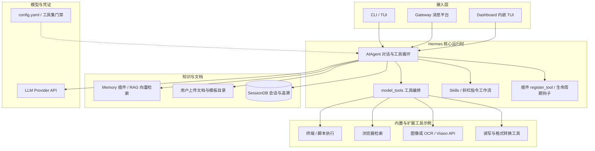
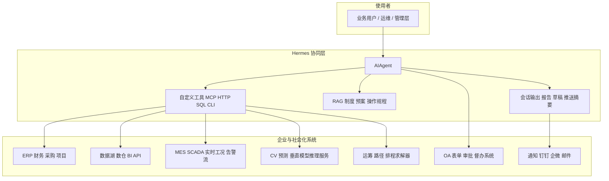
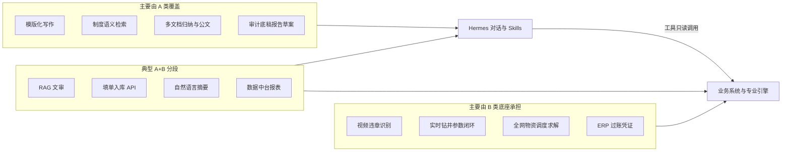
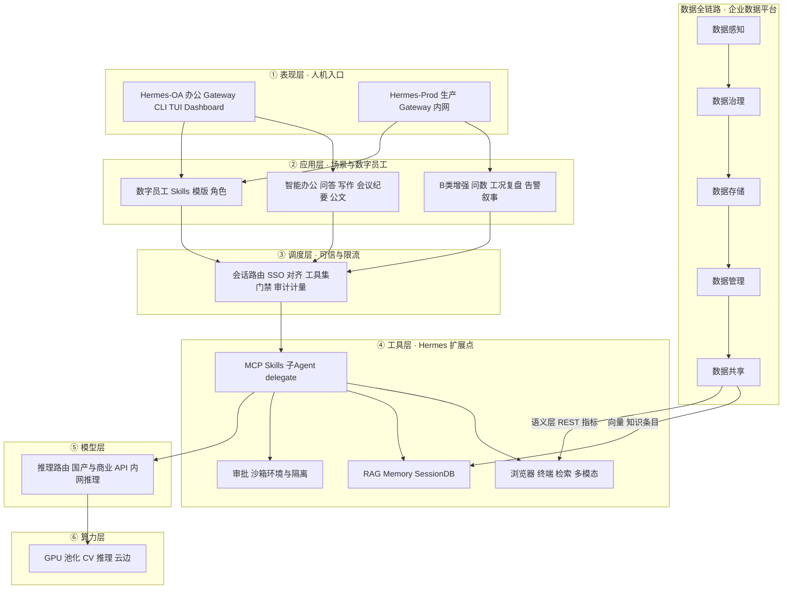

# 需求清单与 Hermes-Agent 适配分析

下文在保留**原始 120 条需求表**（见第二节）的基础上，先做**适配结论总览**：哪些适合用 Hermes-agent 作为主要承载、哪些只适合作“人机协同层”，哪些需要专用系统为主。

---

## 一、Hermes-Agent 能稳定覆盖的能力边界（简述）

| 能力 | Hermes-agent 原生/易扩展支撑 | 典型实现方式 |
|------|------------------------------|--------------|
| 长对话、多轮工具调用、会话与追溯 | ✅ 核心 | `AIAgent`、会话库、网关 |
| 可定制工作流（技能、斜杠指令、插件） | ✅ 核心 | `skills/`、`CommandDef`、插件 `register_tool` |
| 文档理解、改写、模版化写作、抽取结构化信息 | ✅ 强 | LLM + 上传文件/Browser/OCR 类工具按需接入 |
| 知识库检索与合规/制度问答（RAG） | ✅ 强 | Memory 插件、上下文、自建向量库或通过 MCP/API |
| 代码与脚本自动化、数据处理、报表草案 | ✅ 强 | Terminal/execute_code、Python 脚本 |
| 多端接入（CLI/TUI/Web/消息平台） | ✅ 强 | Gateway 各适配器 |
| 实时工业控制、PLC、专网毫秒级闭环 | ❌ 非主攻 | 需 SCADA/MES；Hermes 仅可做指令侧或告警旁路 |
| 高精度专有 CV（违章识别、遥感工程量） | ❌ 模型本体 | Hermes 可调用外部推理服务 API，不负责训练与边缘部署 |
| 深度 ERP/财务专有集成与审计落库流程 | ⚠️ 需定制 | MCP、HTTP 工具、RPA/RPA-orchestration 与公司接口规范 |
| 传统优化求解器级调度（车辆路径、全网调度） | ⚠️ 部分 | Hermes 生成方案草稿与解释；硬核求解用专业引擎 |

---

## 二、120 条需求：适配结论一览

**图例：**  
- **A 类（主承载）**：以 Hermes-agent + Skills/插件/工具链即可交付大部分业务价值。  
- **B 类（协同层）**：底层需数据平台/CV/MES/ERP；Hermes 做问答、报告、编排、对接 API。  
- **C 类（弱相关）**：以科研建模、嵌入式、专有硬件或非对话产品为主 Hermes 仅可作外围文档或 POC。

| 序号 | 适配 | 为何 | 在 Hermes 中大致怎么做 |
|------|------|------|------------------------|
| 1 | A | 与“可信任代理 + Skills + 长任务”高度一致 | 用 Skills 固化工作流；网关/权限/审计由部署与配置约束；长任务用多轮工具与 checkpoint |
| 2 | B | 识别效果依赖专用视觉模型与现场数据 | Hermes 调用模型服务 API、汇总结果、生成告警与整改建议报告 |
| 3 | B | “问数”、流程落库依赖业务系统 | 文审/报告/问答用 RAG；问数通过 SQL/MCP/只读接口工具；填单可走表单 API 或半自动 |
| 4 | A | 文档 ingestion + 法规模板生成 | Skill：读环评 PDF/Word → 抽取字段 → 按备案模板生成；人工校验节点 |
| 5 | B | 图像/因果推理需专有模型与中台数据 | Hermes 聚合文档与结构化数据给出文字风险排序与对策草案 |
| 6 | A | 典型制度/标准检索与引用 | RAG + 定期更新索引；`/search` 或专用 skill 引用条款 |
| 7 | B | “研判”需业务指标与台账 | NL 查询 + Python 分析连接器；结论与措施由 agent 起草 |
| 8 | B | “大数据”在数仓而非 agent 内存 | Hermes 调 BI API 或对导出数据做统计分析脚本 |
| 9 | B | 车载/视频分析在外部 | Hermes 消费告警流、生成画像报告与培训摘要 |
| 10 | B | 路径与成本优化需 OR/专用系统 | Agent 做需求解析、参数准备、结果解释与异常说明 |
| 11 | B | 数字孪生与预测模型在外部 | Hermes 做监控面板自然语言查询、预案与运维知识问答 |
| 12 | A | 文档、语音转写（接 ASR API）、培训内容生成 | Skills：档案摘要、培训大纲、OCR 票据（工具） |
| 13 | B | 1–3 分钟预警需实时工控链路 | Hermes 侧：预案库、事后分析、参数建议文档；实时控制走工控 |
| 14 | B | 全生命周期平台 + 专用模型 | Hermes：知识问答、报告草案、规范检查 |
| 15 | B | 设计辅助可；执行闭环在设备侧 | RAG 历史井 + 生成设计步骤与检查清单 |
| 16 | B | 治理流水线以数据平台为主 | Agent：质量规则说明、元数据问答、清洗脚本辅助生成 |
| 17 | A | 编程辅助是核心场景 | 启用开发类 toolset、Skills 封装团队规范与脚手架 |
| 18 | A | 调研、数据处理、类 OpenClaw 形态 | 检索工具 + 浏览器 + 代码执行 + 长任务会话 |
| 19 | B | 完整 LMS/考试系统需平台 | Hermes：智能组卷/答疑/诊断对话体；与考试系统 API 对接 |
| 20 | A | 模板化报告 | Skill：字段映射、甲方数据校验、多文档合并生成 |
| 21 | B | 推送依赖任务/消息中台 | Agent 生成安全行动计划与总结文本；推送走企业消息 API |
| 22 | B | 问数需数据连接 | 同 #3；可视化用代码生成图表或接 BI |
| 23 | A | 专家知识 + 检索 + 推理链 | 打捞知识库 RAG + 结构化推荐逻辑（工具/Skill） |
| 24 | B | 垂直大模型训练非 Hermes 内置 | Hermes 作推理与可解释展示层（若模型以 API 暴露） |
| 25 | A | 长文档生成 + 合规检查 | RAG 历史中标样本 + 分段生成；风险条款 checklist skill |
| 26 | B | 最低成本调度为运筹问题 | Agent 整理约束与数据，对接求解服务或启发式脚本 |
| 27 | B | 预测模型与财务事实表在数仓 | Hermes：自然语言问经营、解读预测、报告撰写 |
| 28 | B | 数据湖查询引擎为主 | SQL/MCP/元数据目录工具 + 结果解释 |
| 29 | A/B | 文本合同强；扫图需多模态 | Vision API 抽字段 + 规则比对 Skill |
| 30 | B | 钻井工程知识增强决策（多源语义分析） | 实时诊断/预测在钻井专系统；Hermes 读导出或 API，生成诊断叙述与优化建议文稿 |
| 31 | B | 作业全生命周期多系统集成 | Hermes 编排“资料整合—报告—案例录入”的文档类子流程 |
| 32 | A | 模板 + 自动采集数据 | Skill 绑定分离器数据接口或导入 CSV |
| 33 | A | 同 #32 | 返排液模板 skill |
| 34 | B | ERP 深度集成 | 定时任务或网关 hook 拉数；Hermes 生成结算表草案 |
| 35 | B | 全生命周期管理是应用系统 | Hermes 作查询助手、评价报告生成、提醒规则说明 |
| 36 | C | 科研：样本集与 DL 训练 | 非 agent 框架主业；可用 Hermes 写实验笔记与代码辅助 |
| 37 | C | 时序预测模型 | 同上 |
| 38 | B | “平台”含工作流与权限 | Hermes：标书解析、评比维度打分说明、汇总报告 |
| 39 | A | 纪检库问答 + 归纳 | 强 RAG + 严格 ACL（网关身份、数据域隔离） |
| 40 | B | 与监督管理系统深度耦合 | API 事件驱动 + Agent 生成文书与追踪摘要 |
| 41 | C | EMS/能源硬件与边缘控制 | Hermes 不适合做控制核心；可做运维知识库 |
| 42 | B | OCR + 审批流 | Hermes：票据识别（工具）、档案问答；审批在 OA |
| 43 | A/B | 新闻写作可；视频生成需 AIGC 管线 | 文本用 agent；视频接 image_gen/外部服务 |
| 44 | A | 专业翻译 + 文档转换 | Skill：术语表 RAG + 分批翻译 + 格式保留工具 |
| 45 | B | ERP 接口属于集成项目 | HTTP/MCP 工具 + 定时同步脚本 |
| 46 | A | 合同规则库比对 | RAG 集团细则 + 不合规项列表输出 |
| 47 | A | 采购表单审核 | 结构化抽取 + 规则 skill |
| 48 | B | 全流程系统 | Hermes 覆盖文档、检查清单、海外法规问答 |
| 49 | A | 条款抽取与入库 | LLM 抽取 JSON + 校验 schema |
| 50 | A/B | 计划与甘特需项目数据 | 读里程碑数据生成 MS Project/表格；更新靠日报接口 |
| 51 | B | 成本跟踪依赖业务录入 | Agent 计算与偏差分析脚本 + 解释 |
| 52 | B | 同 #51 | 价值工作量公式 skill |
| 53 | A | PMP/prince2 报告 | Skill 模板 + 多维度分析问题陈述 |
| 54 | A | 后评价报告 | 汇总多文档生成章节化报告 |
| 55 | A | 知识库沉淀 | 向量库 + Hermes Memory/检索 skill |
| 56 | B | 统计打分需资源主数据 | 分析脚本 + narrative |
| 57 | B | 评价数据在 HR/项目系统 | 汇总与决策支持文本 |
| 58 | A | 招标文件摘录与建议 | RAG + 竞对知识（脱敏）+ 结构化输出 |
| 59 | B | 设备管理系统为主 | Hermes：自然语言查询与维保建议（接 DB） |
| 60 | B | 临期提醒需可靠调度 | Cron/外部调度 + Hermes skill 推送模板；或仅存规则由网关通知 |
| 61 | A | 重复立项查重 | 关键词/语义检索科研项目库 skill |
| 62 | B | “快速计算”可脚本化 | Skill 封装压井公式（需工程校验），或调用内部计算库 |
| 63 | A/B | 税则判定 | RAG 税则/两用物项目录 + 引用条款输出 |
| 64 | B | 物资主数据与黑名单在库 | NL → 查询工具 + 供应商推荐说明 |
| 65 | B | 统计在业务库 | Python 分析与报告生成 |
| 66 | B | 原文与 #30 重复的钻井分析条目 | 策略同 #30 |
| 67 | B/C | 页岩油压裂出水预警与方案优化 | 多源融合与预测模型以科研/专系统为主；Hermes 做历史案例检索、方案比对说明 |
| 68 | B | 邻井测井分析、实时建议、完井报表 | 对接实时分析软件或数据导出；RAG + 模板自动填表 |
| 69 | A | 合同关键信息抽取 + 法规合规审查 | RAG 法规库 + 风险条款标注 skill；结构化写入由下游系统完成 |
| 70 | A | 招标文件处理与标书自动生成 | 与 #25、#58 同类：长文档 skill + 企业知识 RAG |
| 71 | B | 管理会计驾驶舱 | 数据汇总在 BI/数仓；Hermes 提供自然语言问数与经营叙事 |
| 72 | B | ERP 财业融合分析与预测 | 只读财务/业务 API 或导出表 + 安全查询工具 + 多视角解读报告 |
| 73 | A | 大集中 ERP 使用自助问答 | 典型文档 RAG（蓝图、规范、历史 Q&A） |
| 74 | B | 战略规划制定与执行闭环 | 主系统为计划/项目管理平台；Hermes 生成规划草案、目标分解表、追踪摘要 |
| 75 | B | “基地综合利用”分析与布局 | RAG + 数据分析；布局优化需规划模型 |
| 76 | A/B | 建设数据分析与建议 | 导入表格分析 + narrative |
| 77 | B | 市场准入智审 = OCR+NLP | Hermes + 证照解析工具；区块链存证非内置 |
| 78 | A | OpenClaw 式审计 agent | Skills：凭证分类、 anomaly 摘要、审计程序 checklist |
| 79 | A | Workbuddy 类比 | 同 #78，命名差异 |
| 80 | A | 财务附件 OCR | 多模态工具 + 字段 schema 抽取 |
| 81 | C/B | “RPA 机器人”通常用专用 RPA | Hermes 可生成/维护 RPA 脚本或 SSH 批量任务但非替代 |
| 82 | A | 制度语义检索 | 同 #6 |
| 83 | A | 审前分析问题归纳 | RAG 历史案例库 |
| 84 | B | 业务数据语义查询 | Text-to-SQL 或安全封装查询工具 |
| 85 | A | 底稿草案 | RAG + 制度 + 上传底稿模板 |
| 86 | A | 审计报告生成 | 多文档归纳 + 大纲 skill |
| 87 | A | 周报写作 | 汇总智审平台导出材料 |
| 88 | A | Excel 关联处理 | Python/pandas 工具 + 自然语言描述 |
| 89 | A/B | 会议纪要 | ASR 服务转写 + LLM 提炼；实时会议需对接会议系统 |
| 90 | B | 数智人语音 | TTS/ASR 在前后端；Hermes 为对话大脑 |
| 91 | B | 同 #3 | 重复条目，策略同 QHSE 智慧监管 |
| 92 | B | 班组风险多模块 | 事故分享/培训可用内容生成；违章识别需 CV |
| 93 | B | 培训平台完整闭环 | Hermes：课程推送文案、考核题、能力摘要 |
| 94 | A/B | 法规更新可半自动 | 爬虫+摘要（合规审查）+ RAG；与官方源校对需流程 |
| 95 | B | PHM 模型在 IoT | Hermes 查询健康度与报表 |
| 96 | B | 全程监控 CV | Hermes：报告与合规 checklist |
| 97 | B | 应急推演heavy | Hermes：预案检索、推演脚本草稿、复盘报告 |
| 98 | B | AI 生成视频 | 文案与脚本 A 类；成片用视频引擎 |
| 99 | A | 问题分类与整改方案 | NL 分类 + 知识库映射体系要素 |
| 100 | A | 手写 OCR | 多模态/专用 OCR API + 结构化 |
| 101 | B | 智慧钻井全景 | Hermes 为众多子智能体的门户与文档层 |
| 102 | B | 钻井液 AI 实验室 | 科研平台为主 |
| 103 | A | QHSE 专业知识库 | 个人/共享知识库 + ACL |
| 104 | B | 固井监测预警系统 | 专用模型与中台 |
| 105 | B | 光纤判别 | 专业算法 |
| 106 | B | 气体钻井预警 | 专系统 + agent 解读 |
| 107 | B | 压裂工程设计决策 | 数据中台 + agent 交互 |
| 108 | B | LIMS | 化验设备集成 |
| 109 | C | 分子模拟科研 | Hermes 仅辅助文献与脚本 |
| 110 | A | 材料编写辅助 | 通用写作 skill |
| 111 | A | 公文生成 | 模板 skill |
| 112 | B | PPT | 可用代码生成或可接 office 自动化工具 |
| 113 | C | 研发平台 KPI | 与 agent 架构弱耦合 |
| 114 | B | 钻井工程设计 | RAG + 专业工具链接 |
| 115 | B | 实时工况 | 与分析软件/event 流集成 |
| 116 | B | 建筑违章 CV | Hermes 接识别 API |
| 117 | A/B | 投标与模拟评标 | 标书生成 A；模拟评标需规则引擎 + 打分模型 |
| 118 | B | 无人机土方 CV | Hermes 消费识别结果写成本分析 |
| 119 | A | 纪要督办拆解 | NLP 抽取任务、责任单位映射表 skill |
| 120 | A | 情报+招标+投标文件 | 浏览器/订阅 + RAG + 长文档生成 |

**统计倾向（粗略）：**  
- **A 类**：约 **35–42** 条（办公文档、检索、稽核文职、模版报告、翻译与数据处理、纪要督办等偏重）。  
- **B 类**：约 **65–72** 条（需数据中台/CV/MES/ERP/优化器，Hermes 作交互与编排）。  
- **C 类**：约 **8–12** 条（纯科研训练、硬核控制、替代 RPA/视频引擎本体等）。

---

## 二点五、A 类与 B 类实现架构图

**读图约定：**实线表示主数据流；Hermes 仓库内对应关系见 `AGENTS.md`（`run_agent.py`、`model_tools.py`、`toolsets.py`、`skills/`、网关 `gateway/`）。

### A 类（主承载）——以 Hermes 为中心的实现架构

适用于：制度/纪检/审计检索与文书、公文与报告模版、会议纪要督办、标书与合同文本类、翻译与 Excel 处理、编程辅助、QHSE 知识库等。**价值主要由「对话 + RAG + Skills + 内置工具」闭环交付**，对企业系统的依赖多为可选（如仅人工上传文件）。

**要点：**  
1. **编排中枢**是 `AIAgent` + `handle_function_call` 工具链路，不以单独微服务重复造对话引擎。  
2. **可复用业务逻辑**优先落在 **Skills**（版本化、可共享）与**小型自定义工具**（`tools/*.py` + `toolsets.py` 注册），避免把流程写死在一次性脚本里。  
3. **权限与可信**：网关身份、租户/数据域隔离、哪些工具可访问外网/文件系统，由部署与 `config.yaml` 门禁控制，满足「可信任代理」类需求（如 #1、#39）。

---

### B 类（协同层）——Hermes 作为「认知与编排壳」

适用于：智能问数、ERP/结算、实时工况与预警、视频监控类识别、运筹调度、数字孪生与 PHM、培训与任务推送等与**企业系统/CV/MES**强绑定的场景。Hermes **不替换**数据源与专有算法，而通过 **HTTP / SQL（只读封装）/ MCP / 消息订阅**读取事实，再产出**自然语言解释、报告、处置建议文稿、工单摘要**并可写回允许的 API。

**要点：**  
1. **数据真相源**在左侧各系统；Hermes 工具层必须 **白名单化**（只读库账号、行级权限、内网 API），Text-to-SQL 等能力需加 **审核与参数绑定**，避免越权。  
2. **实时闭环**（如毫秒级联锁、工控下位机）仍在 **MES/PLC**；Hermes 处理 **告警后的**知识检索、预案匹配、周报与复盘 (#13、#95–#97 等)。  
3. **CV 与垂直模型**以 **REST/gRPC** 暴露；Hermes 传图或事件 ID，拿回结构化标签后再做叙述与工单 (#2、#9、#96、#116–#118)。  

---

### A/B 对照：职责切分一览

便于架构评审时快速对齐边界（同一业务流程常同时含 A、B 两段：例如「文审」在 Hermes+RAG 完成，「台账落库」走业务 API）。

---

## 二点六、Hermes-Agent 整体建设架构总览（对齐分层建设视图）

本节参考「整体建设架构总览」类分层画布：左侧为**自上而下六层**，右侧为**数据全链路**；将能力标注为 Hermes **仓内映射**与企业需补的**平台组件**。与前文「A/B」「办公网/生产网双实例」兼容：**表现层 / 调度层**按域分列，**工具层 / 模型层**共享同一套软件制品与研发流程。

### 建设阶段图例

| 标记 | 含义 |
|------|------|
| **【现有】** | Hermes-agent 仓库已具备或可配置即用（`run_agent.py`、`gateway/`、`skills/`、`tools/`、`model_tools.py`、Memory 插件等） |
| **【增强】** | 不改变核心架构前提下，企业通过**策略、网关、限额、观测、集成**加厚（SSO、DLP、只读网关、配额、计费对接等） |
| **【新建】** | **企业基建或二期项目**：向量/湖仓平台、数据中台语义层、工控告警总线、异构算力调度、模型训推管线等 Hermes **消费其 API** |

### （一）表现层｜人机入口

| 建设 | 组件 | Hermes / 交付说明 |
|------|------|-------------------|
| **【现有】** | 交互 CLI / TUI | `cli.py`、`hermes --tui`、`tui_gateway/` |
| **【现有】** | Dashboard 嵌入式对话 | PTY + `web_server`/`ChatPage`，内嵌 Ink TUI |
| **【现有】** | Gateway 多端 | `gateway/platforms/`（企微 / 钉钉 / Slack / Telegram …） |
| **【增强】** | **办公网入口** Hermes-OA | 面向 A 类与高敏 OFFICE；独立域名、IAM、水印、审计 |
| **【增强】** | **生产网入口** Hermes-Prod | 面向 B 类问数/工况；与 DMZ/API 网关、Kafka 告警消费联动 |
| **【增强】** | 统一门户 / 移动端 | 「数字办公大厅」等与 Hermes 单点跳转或网关路由集成 |

---

### （二）应用层｜场景与数字员工（A+B 融合视图）

#### 智能办公（偏 A）

| 建设 | 场景示例 | Hermes 落地 |
|------|----------|-------------|
| **【现有】** | 制度/标准智能问答 | RAG + Memory 插件 / 文档工具 |
| **【现有】** | 写作、翻译、研报、会议纪要 | Skills + LLM；会议接 ASR【增强】API |
| **【增强】** | 招投标/合同/审计底稿 | Skill 模版 + `enabled_toolsets` 收敛 |
| **【新建】** | 思维导图/PPT「一键成片」插件 | Hermes **编排**，Office/AIGC 能力接工具或 MCP |

#### 数字员工 / 垂直智能体（A+B）

| 建设 | 角色示例 | 说明 |
|------|----------|------|
| **【增强】** | QHSE 专员、审计专员、纪检监察助手 | OA 实例 + 强 ACL RAG |
| **【增强】** | 工况解读、告警复盘、问数专员 | Prod 实例 + 语义层/只读库工具 |
| **【增强】** | 软件开发 Copilot | 开发 toolset、`delegate_tool`/子 Agent |
| **【新建】** | 评标规则引擎、专有垂直模型网关 | Hermes **调外部服务**，不替代业务确定性引擎 |

---

### （三）调度层｜流量与信任根

| 建设 | 能力 | Hermes / 企业对齐 |
|------|------|-------------------|
| **【现有】** | 会话与消息路由 | `gateway/run.py`、平台适配器、`session_key` |
| **【现有】** | 身份与会话绑定 | 各平台 `user_id`/`chat_id`；Profile `HERMES_HOME` |
| **【现有】** | 工具集门禁 | `enabled_toolsets` / `disabled_toolsets`、`config.yaml` |
| **【增强】** | 企业 SSO / RBAC | 网关前 **IdP**；按角色下发不同 toolset 与路由（OA/Prod） |
| **【增强】** | 流控、审计、留痕 | `hermes_logging.py`、网关日志；对接 SIEM【新建】 |
| **【增强】** | 计量与成本 | 迭代预算、日志中的 token 线索；对接计费中台【新建】 |

---

### （四）工具层｜编排、记忆、RAG、安全（Hermes 能力最集中的一层）

与参考图「工具层」子域一一对应，便于评标与对标。

#### 插件 / Agent 编排

| 建设 | 项 | Hermes 映射 |
|------|-----|-------------|
| **【现有】** | 工具注册与派发 | `tools/registry.py`、`model_tools.handle_function_call()` |
| **【现有】** | MCP、HTTP、终端、浏览器等工具 | `toolsets.py` + 各 `tools/*.py` |
| **【现有】** | Agentskills / 工作流 | `skills/`、`agent/skill_commands.py` |
| **【现有】** | 子 Agent / 多步委托 | `delegate_tool.py`（子任务隔离） |
| **【增强】** | Prompt/模板治理 | Skill 前言、企业级模版库、「缓存不破坏」规范（见 `AGENTS.md`） |
| **【新建】** | 可视化拖拽编排引擎 | Hermes **外置** BPM/低代码 **或** MCP 挂载；核心是稳定 API |

#### 内置能力与多模态

| 建设 | 项 | Hermes 映射 |
|------|-----|-------------|
| **【现有】** | Web 检索 / 爬虫类 | 浏览器、`web_search` 等工具（按 key 解锁） |
| **【现有】** | 多模态解析 | Vision/OCR/PDF **工具或 Provider 能力**，按接入方式启用 |
| **【增强】** | 对内知识库爬虫 | 【新建】采集管道 + Hermes **仅消费**处理后的索引 |

#### RAG 与知识基础设施

| 建设 | 项 | Hermes 映射 |
|------|-----|-------------|
| **【现有】** | 向量检索与 Memory Provider | `agent/memory_*`、`plugins/memory/*` |
| **【新建】** | 知识图谱、父子分段索引、LLMWiki | 企业知识中台；【增强】Hermes侧 **GraphRAG/API** |
| **【增强】** | 办公/生产分索引 | 双实例两套 collection 或与 **行级租户** 隔离 |

#### 评测、沙箱与安全

| 建设 | 项 | Hermes 映射 |
|------|-----|-------------|
| **【现有】** | 终端/Docker等执行环境 | `tools/environments/*` |
| **【现有】** | 人机审批（敏感工具） | Gateway/CLI Clarify、`approval` |
| **【增强】** | 智能体红队评测、离线回归集 | 企业评测平台；【增强】固定测试 **Skills**/回放会话 |
| **【增强】** | 合规审计、策略引擎 | 出站代理、DLP、工具白名单；与「不推荐做法」表一致 |

#### 记忆引擎

| 建设 | 项 | Hermes 映射 |
|------|-----|-------------|
| **【现有】** | 对话与会话持久化 | `hermes_state.py` / SessionDB、FTS |
| **【增强】** | 任务记忆 / 长任务状态 | `todo`、会话内 checkpoint；企业侧 **工单号** 外挂 |
| **【增强】** | 工具调用记忆与追溯 | 会话消息中的 `tool` 角色；日志关联 `task_id` |

#### 运维管理

| 建设 | 项 | Hermes 映射 |
|------|-----|-------------|
| **【现有】** | 调用与错误日志 | `agent.log` / `errors.log` / `gateway.log` |
| **【增强】** | Token/成本看板 | 对接可观测/计费；或定期解析日志【新建】ETL |

---

### （五）模型层｜推理与生命周期

| 建设 | 项 | Hermes 映射 |
|------|-----|-------------|
| **【现有】** | 多厂商 Chat API | `run_agent` Provider 适配、凭证池 |
| **【增强】** | 国产/内网模型统一路由 | 推理网关、AB 测试、降级链 |
| **【新建】** | 数据供应、训练、压缩、安全评测 | **企业 MLOps**；Hermes 仅消费 **推理端点**（与 #24 等垂直模型分工） |

---

### （六）算力层｜资源与云边

| 建设 | 项 | 说明 |
|------|-----|------|
| **【新建】** | GPU 池化、虚机/容器调度、云边协同 | Hermes 进程本身轻量；**推理与 CV 服务**部署于算力平台 |
| **【增强】** | 生产区 **内网推理集群** | Prod 实例 LLM/CV **不出公网** |

---

### 右侧：数据全链路（支撑应用层与工具层）

数据侧多为 **【新建】+【增强】**；Hermes 主要落在 **消费「数据共享」层**。

| 环节 | 典型内容 | 与 Hermes 关系 |
|------|----------|----------------|
| **数据感知** | ERP/MES API、文件、历史会话、Kafka 工控告警、无人机/CV 回调 | 工具 `HTTP`/`SQL`/`消息订阅`【增强】封装 |
| **数据治理** | 清洗、解析抽取、质量规则、PII 脱敏 | 企业治理平台；产出 **可检索文档/宽表** |
| **数据存储** | 向量库、数据湖/仓、对象存储 | RAG 索引源；**问数**走语义层或只读副本 |
| **数据管理** | 权限、共享策略、租户隔离、分类分级 | 与调度层 RBAC、双域部署一致 |
| **数据共享** | REST、**MCP**、**Skills** 包、指标 API | Hermes 工具白名单只暴露允许的数据产品 |

---

### 总览关系图（分层 + 数据馈入 + 双域）

顺序与常见「六层总览」一致：**自上而下**为表现 → 应用 → 调度 → 工具 → 模型 → 算力；**数据链**自下而上产出「数据共享」，馈入工具层（RAG/问数工具）。

---

## 三、原始需求表（1–120）

序号	需求场景	场景类型	具体需求描述	预期效果	优先级
1	基于国产可信任工作 AI 代理的应用研究	个人办公业务优化	1. 现工作应用中员工个人能力无法通过 LLM 类型 AI 对话工具进行持续放大；2. 基于算力、资源、开发能力限制，仅通过 API 调用 + 软件方式呈现，开发成本高、人员能力培养周期长；3. 落地 openclaw、qwork、扣子长任务模式、caude code 等类似可信任、安全可控工具，让具体业务人员可自定义 skills 等工作流，有效提升工作效率、提高 AI 应用普及。	1. 提升工作效率2. 产出优秀工作流实现经验和高水平业务能力复用3. 提升长周期任务模式下 AI 辅助能力，极大提高研发水平	高
2	基于 AI 图像识别的油气作业现场行为安全风险识别效果提升	生产	通过持续的技术攻关，解决特定复杂场景下 AI 识别模型应用效果不佳的问题，逐步替代传统人工监督，支撑各业务环节安全风险管控。	提升模型泛化性和识别准确率	高
3	基于大模型的 QHSE 智慧监管系统	生产	以大模型为基础，结合 QHSE 智慧监管系统实现一系列业务流程优化：智能文审：利用人工智能技术自动对文本内容进行分析、检测、评估。履职能力 AI 评估：实现 AI 评估、AI 访谈等功能报告方面：报告自动生成、内容自动总结、关键内容提取等自动填单：结合语音转文字实现自动填单等功能智能问答：结合知识库实现智能问答智能问数：结合数据库数据实现智能问数等功能	结合 AI 提高数据录入质量和录入效率通过智能问答、智能问数提升业务数据获取效率通过 AI 辅助分析提高安全管控水平	高
4	基于单井钻井环评文件及公司预案体系，完成钻井现场环境风险评估及突发环境事件应急预案的编写	生产	按照国家环境应急预案备案要求，钻井项目需编制环境风险评估报告、应急资源调查报告、突发环境事件应急预案；委托第三方编写成本高、耗时长。通过 AI 工具读取单井环评报告，补充联系方式，自动分析编制备案成套资料。	单井开钻前完成环境应急预案编写，及时组织专家评审并完成生态部门备案，确保环境应急体系有效运行。	中
5	基于大模型的钻井现场安全环保智能分析与决策优化	生产	构建以钻井现场安全环保管理知识增强的大模型为核心引擎的智能决策系统。利用图像识别、自然语言理解、多源信息融合与因果推理能力，关联分析现场安全环保风险，提示风险、排序 HSE 管理薄弱环节，提出对策并跟踪效果。	降低现场违章率，削减作业风险，减少事故事件，持续保持现场标准化管理	中
6	文件、标准日常查询引用	生产	实时自动更新替换，随时查找引用公司各类文件及标准，对照检查问题并给出支撑依据	全面实时掌握公司管理要求	高
7	固废管理决策和现有管理的研判	生产	识别钻井现场环保管理是否适应当前要求，分析风险并提出管理措施	-	中
8	环保数据分析	生产	对固废、废水等废弃物产生情况进行大数据分析，定位超量原因（工艺、钻井液性能、管理），提供解决方案	-	高
9	车辆安全智能监控与风险预警	生产	升级 AI 安全预警模型，融合车载终端、视频监控、物联网数据，构建驾驶员安全行为画像，实现危险行为自动识别、风险分级预警、VR/AR 智能安全培训。	安全预警准确率≥90%，驾驶员安全行为评估覆盖率 98%，降低车辆安全事故率。	高
10	前瞻性供应链智能运营与成本核算	经营	基于 AI 算法重构物资计划、采购、仓储、配送全流程，实现智能拼装、动态路径优化、单车成本智能核算、服务商智能评价。	供应链核心业务线上化率 100%，单车成本核算准确率≥95%，运输效率提升、成本降低。	高
11	零散天然气智能管控与预测性维护	生产	构建 AI 预测性维护模型、数字孪生场站，实现设备故障提前预警、产量智能优化、安全风险自动干预、低碳运行智能调控。	设备故障预测准确率≥90%，天然气回收利用率提升 10%，实现场站无人化智能运营。	高
12	数智办公智能辅助与人才管理	办公	部署智能语音助手、文档智能体、OCR 识别，构建人才数字档案与智能培训体系，实现人岗精准匹配、培训计划自动生成。	办公效率提升 30% 以上，人才培养与岗位适配更精准。	中
13	智能压裂现场智慧体	生产	传统压裂依赖 “人盯井”，风险预警滞后、协同效率低、参数依赖经验、非生产时间长；构建 AI 智慧体，实时监控设备与参数，提前 1-3 分钟预警砂堵 / 泵机故障，自动触发预案；动态优化压裂参数，支持远程一键协同控制。	1. 压裂作业综合效率提升，压缩非生产时间 35%2. 砂堵等核心风险发生率降低3. 现场值守人员减少，人力成本显著降低4. 压裂施工参数匹配精度提升，单井产量提升	高
14	智慧固井系统	生产	构建固井智能设计、实时智能决策、智能评价 AI 智能体，建立统一数据中台与 AI 引擎，实现多源数据融合、模型共享、知识图谱构建，形成自主感知 / 推理 / 决策 / 学习的智能单元，实现固井全生命周期智能化管理。	实现固井方案自动生成、施工在线智能决策、质量智能评价、报告自动输出，全流程智能闭环，从人工经验驱动升级为 AI + 数据 + 机理 + 知识联合驱动	中
15	智能连油系统	生产	基于大模型实现连续油管智能设计：选定井号后总结历史施工情况，给出工具、参数、步骤、模拟验证；智能决策分析：规范施工流程，监测参数，自动判断起下、预警、设定并执行参数。	1. 提高设计编制效率2. 提高现场施工效率，智能监测降低施工故障风险	中
16	井下作业数据治理综合智慧体	生产	业务数据分散、标准不统一、质量低、安全管控不足，导致 AI 模型训练周期长、精度低、共享难；构建统一数据治理智慧体，覆盖采集、清洗、标准化、标注、脱敏、溯源，建立统一标准，智能监测质量，搭建安全管控模块。	AI 模型训练数据准备周期缩短；数据质量与准确率提升；跨部门共享效率提升；安全违规事件降低，满足合规要求	中
17	综合软件编程智慧体	办公	各业务 AI 场景开发存在代码效率低、跨框架集成难、重复编码多、技术门槛高，导致落地周期长、维护成本高	提升编程效率质量，解决信息技术人员不足问题	中
18	资料调研、数据处理	办公	（1）专业文献智慧调研、分析及报告生产；（2）专业大数据智能处理、数据报表生成；（3）办公智能体 Openclaw	扩展工作场景，缩短工作时长，提升工作效率	高
19	技能培训与攻关创新	生产	一、建设 AI 智能培训平台，形成学习 - 训练 - 答疑 - 考核闭环；二、建设考核认证辅助系统，实现智能组卷、自动阅卷、智能评分、证书管理；三、构建生产问题智能诊断助手，支撑复杂工况处置；四、支撑创新点子征集、方案研判、优化推演、成果沉淀。	培训资料准备时间缩短 30% 以上；事务性工作量下降 50%；典型问题分析时间缩短 40%；提升技改立项质量与创新转化率	中
20	试油井史报告生成智能体	生产	基于甲方资料、压裂数据、现场地质 / 工程 / 测试数据，按标准模板整理核对汇编，快速生成规范化试油井史报告、完井交接井书、地质总结报告	降低数据分析门槛，业务管理人员可直接用自然语言获取数据洞察	中
21	智能任务推荐智能体	生产	实现智能任务推送、个人安全行动计划智能生成、个性化智能工作总结辅助	根据岗位与场景自动推荐任务、生成安全计划，减轻事务性负担，提升工作条理性与质量	中
22	智能问数智能体 + 智能工作总结	生产	1. 基于基层台账、实时数据，AI 理解自然语言并融合数据资源，构建问数智能体；2. 智能报表、智能数据分析，快速生成可视化报表与深度挖掘	1. 降低数据分析门槛，自然语言获取数据洞察2. 动态生成可视化报表，缩短查询与制作周期，提升决策响应速度	中
23	基于大修打捞工序的智能专家	生产	模拟人工专家逻辑推理，实现最优打捞工具识别、教学、精准匹配及工艺推荐，形成打捞设计方案，解决依赖经验、试错成本高、成功率不稳定问题	转变为数据驱动、精准决策的智能化流程，提升打捞成功率，降低成本与风险，推动数字化升级	高
24	基于大模型的井控工程智能分析与决策优化	生产	现有井控大模型工业场景落地能力不足，依托 CQ 智能体体系攻关核心技术，开展井控专业精细化训练，打造垂直领域大模型	决策方案完整可解释，100% 附带推理过程；专家经验拟合度≥90%；向数据驱动、模型辅助、人机协同转型	高
25	智能招标方案、标书制作	办公	招标方案制作反复修改耗时长；外部市场拓展标书工作量大、人员经验不足，需提高中标概率、规避合规风险、提升编制质量与效率	依据项目要求自动生成标书、招标方案，提高中标率，加快招投标环节，承揽工作量、筛选承包商	高
26	智能调度	生产	钻井队生产不连续，需及时调度物资；资质号压减，队伍数大于资质号，需及时调度保障开钻	最低成本调度物资与资质号，避免等停提高运行成本	中
27	智能节余预测	经营	精细化管理下成本收入维度多、难以统一度量，通过 AI 构建智能节余预测，实时观测经营效果	构建经营节余智能预测体，实时展现财务状况，提前盈利预测，保障项目不超额乃至盈利	高
28	基于统一数据湖的钻井工程智能数据查询	生产	钻井工程数据分散、治理不规范、存在孤岛，查询分析效率低；依托统一数据湖归集治理数据，搭建分层分域智能查询模块，打通数据共享通道	实现全业务域数据高度共享、规范管控、高效查询、来源可追溯，打破数据壁垒，支撑智能办公 / 生产 / 经营	-
29	基于全模态大模型的辅助合同审查	办公	构建识图并读取合同签约依据、采购 / 招标结果的模型，核对合同金额、履行期限、承包商名称、账户信息等基础信息，让管理员专注条款细化	准确核对基础信息，提升审查效率，降低填报错误率	高
30	基于大模型的钻井工程智能分析与决策优化	-	构建石油专业知识增强大模型引擎的钻井智能决策系统，统一语义化理解与关联分析地质、工程、实时参数、录井、历史案例等数据	实时诊断井下工况、精准预测井漏 / 卡钻等风险，生成提质、增效、降本、安全的优化决策建议	中
31	基于大模型的连续管作业全流程智能决策与风险预警系统	生产	作业前：自动整合资料、推荐参数、预判风险、生成预案；作业中：融合数据优化参数、推送处置方案、计算管柱寿命；作业后：自动汇总报告、录入案例、评估设备健康	缩短作业准备时间；提升复杂工序效率；降低作业事故率；提高管材利用率；实现知识传承与人员能力提升	低
32	基于模板自动生成完井资料	生产	构建石油模型，基于完井资料模板，根据分离器数据采集系统自动生成完井资料	减少完井资料滞后、错误	高
33	基于模板自动生成返排液拉运资料	生产	构建石油模型，基于甲方模板，输入数据后自动生成返排液资料	减少资料滞后、错误	高
34	构建大 AI 经营系统	经营	每月自动调取 ERP 领料、维修、车辆成本形成支出成本，根据生产报表自动生成结算报表，推送项目部财务，减少来回签字	减少每月结算来回审核和用车成本	高
35	基于数字生产模型，提高生产时效，减少人力及沟通成本	生产、经营管理	对工程类承包商建立全生命周期管理：创建队伍号→线上核查→结果反馈→使用申请；日动态管控；工作量与合同金额管控；季度业绩评价；QHSE 违约扣款录入并结算扣减	线上查询结果、整改提醒；规范队伍管理；替代线下收集；准确反映工作量；自动业绩评价；便于结算扣减与安全表现分析	-
36	基于人工智能方法的储层改造优化与风险预警关键技术研究	科研	构建压裂工况样本集，利用大模型与深度学习实现压裂阶段自动划分与关键事件精准识别	提升工况识别与决策效率	高
37	基于人工智能方法的储层改造优化与风险预警关键技术研究	科研	基于时序数据与物理机理融合，开发压力预测模型，提前 30 秒以上预测压力趋势，支撑施工预判	大幅提升风险防控能力	高
38	智能招投标平台	生产	支撑公司智能抓标、标书评比等工作	-	-
39	基于纪检问题数据库的监督工作职能分析	办公	基于问题数据库开发 AI 智能问答，自然语言提问，识别关键要素，检索归纳，识别共性风险与潜在问题，给出监督建议，严格权限与安全	秒级响应，大幅提升监督效率；避免人工疏漏与主观误判，提升识别客观性与准确性	高
40	AI + 监督智能体	生产	深化 “4×3” 运行机制，人工执行易漏项、滞后、标准不一、留痕不全；AI 替代 80% 重复性文书工作，聚焦现场监督，实现预警与隐患全生命周期追踪	深度适配监督管理系统，覆盖核心作业场景，降低运营成本、减少事故，从人防 + 技防向智防升级，可集团内推广	高
41	光伏绿色营区 AI 管控研究	-	统一储能 EMS 集中管控；AI 天气预判、充电策略；故障自动处置、安全风险监测保护；远程指导派单；资产追溯、数据归集、碳核算、AI 运维知识库	减少人力投入，提升智能化程度，提高绿色产业推广竞争力	高
42	职工个人填报 -- 智能识别 -- 逐级审批 -- 档案完善 -- 提醒申报 —— 持续帮扶	办公	通过填报审批，AI 大数据整合困难职工档案，自动识别医疗票据，提醒申报帮扶，同步完善档案，判断在档 / 脱档 / 持续帮扶	自动筛查、精准画像、全程跟踪，变人工走访为数据赋能，形成发现 - 帮扶 - 退出闭环，确保政策精准落地	高
43	AI 辅助生成新闻产品	-	构建石油领域专业知识增强大模型引擎的新闻产品生成模型	安全生成新闻图文和视频，符合新闻规范，满足发稿需求	中
44	基于大模型的 AI 智能翻译工作（文档转换）	办公	构建石油专业词汇增强大模型翻译平台，智能识别翻译文档、图片，支持文档转换、多语言互译	缩短翻译时间，提升效率，节省成本	高
45	ERP 数据对接	办公	纪委办公室需 ERP 接口对接海外数字监督模型，自动推送运行问题进行分析比对	统一数据来源，减小维护成本	高
46	基于人工智能的合同分析研究	办公	提供合同流程文件，以集团细则为库，分析合同不合格问题	大幅提高工作效率	高
47	基于人工智能的采购业务分析	办公	提供采购业务表单资料，AI 自动识别不合规问题并预警	大幅度提高工作效率	高
48	基于大模型的项目管理全流程智能化控制	生产	构建项目运营管理全流程、全过程辅助系统	解决海外项目管理人员紧缺、资料无法全面覆盖问题	高
49	合同文本智能分析与关键条款提取	生产	自动提取进度、结算、方式等条款与时间，转化为结构化数据存入约束性数据表	解决人工查找弊端，解放项目管理人员机械劳动	中
50	项目计划自动生成与跟踪	生产	根据合同里程碑时间自动生成进度 / 成本 / 收入计划、甘特图，根据生产日报同步更新	解决人工录入延迟，降低错误率与人工干涉，缩短工作时长	高
51	项目直接成本自动跟踪	生产	根据设置的成本单价与项目进度，自动生成实时成本，对照计划实时分析	解决人工录入延迟，降低错误率与人工干涉，缩短工作时长	高
52	项目价值工作量自动跟踪	生产	根据合同结算价格、节点与生产进度，自动生成当日价值工作量，对照计划实时分析	解决人工录入延迟，降低错误率与人工干涉，缩短工作时长	高
53	项目阶段分析报告	生产	结合 PMP/prince2 方法论与国际管理工具，以结算点为阶段，多维度分析项目运营，提炼做法、提出改进、形成报告并打分	解决海外项目管理人员专业知识欠缺、法规标准认知不足，提供良性建议	中
54	项目后评价	生产	综合项目资料形成后评价报告	缩短工作时长，降低错误率	低
55	项目管理知识库	生产	归纳项目报告、经验形成向量知识库	总结运营经验，支撑大模型微调迭代，提升管理人员水平	低
56	项目资源库	生产	统计分析资源提供方、使用方、利用率、功能、占比，按方法论打分形成结构化资源库	总结资源信息，支撑大模型微调迭代，提升资源选取效率	低
57	项目经理库	生产	评价项目经理表现并打分，形成结构化库	为决策层提供人员选取参考	低
58	基于大模型的招标文件分析与决策优化	经营	构建石油专业知识增强大模型引擎的投标决策系统，摘录分析招标文件关键内容，结合多类数据给出最优技术与商务建议	以最大概率中标为目标给出优化决策建议	高
59	基于海外作业队伍主体设备使用与管理智能分析优化	生产	构建海外全方位设备材料智能管理系统，整合基础数据，管理设备资料、使用、维保、故障数据	适配海外项目本土化操作，提前数据整理，推广设备 AI 智能化	中
60	证件查及到期提醒	生产	获取证件数据库接口，自动监控井控、硫化氢、防恐、HSE、特种操作证等日期，临期自动推送提醒	大幅提高管理效率	高
61	基于大模型的科研项目重复研究查询	科研	通过关键词自动判断科研项目是否重复研究	-	高
62	井工程实用快速计算	生产	压井、井眼清洁度计算	-	高
63	基于大模型的出口税则智能分析与决策优化	办公	以境外项目物资历史数据为基础，结合海关税则、许可证、两用物项目录构建大模型，辅助税则号判定，降低进出口风险	实时诊断税则号合规性；自动识别许可证管理；自动分析两用物项管理	高
64	基于大模型的物资管理	办公	以 62 大类物资为基础构建智能大模型，扫描物资计划，快速识别类型、编码、历史价格、推荐供应商（识别黑名单）	大幅提高工作效率	中
65	中心历年生产数据统计及分析	办公	构建生产数据统计智能分析模型，解决人工统计效率低、易出错问题	缩短工作时长，降低错误率	低
66	基于大模型的钻井工程智能分析与决策优化	-	构建石油专业知识增强大模型引擎的钻井智能决策系统，统一语义化理解与关联分析多源数据	实时诊断井下工况、精准预测风险，生成提质增效降本安全的优化决策建议	-
67	基于多源数据融合的页岩油压裂出水风险预警与智能方案优化	科研	构建地质 - 工程数据驱动的出水预警与优化系统，整合多类数据建立知识图谱，学习历史特征建立风险预测模型	多源数据融合与知识图谱构建、出水风险智能识别与预警、压裂方案智能优化与推荐	高
68	基于大模型的钻井工程智能分析与决策优化	生产	导入邻井测井数据自动多维度分析，生成报表与防碰数据；施工中实时跟踪推送建议与预警；完井后汇总分析、自动填充报表	控降故障复杂、提速、提质	高
69	智能合同审查	经营	融入 AI 智能抽取与合规审查：自动识别关键信息结构化存储；内置法规库实时检查，标注风险并提供修改建议	辅助合同审查人员进行合规性检查	高
70	智能标书生成	-	解决投标信息分散、制作周期长、人工依赖高痛点，构建系统实现招标文件智能处理与标书自动生成	缩短员工编写标书时长	中
71	智能决策分析	-	财务管理以传统核算为主，经营数据分散缺乏统一分析工具；构建平台遵循管理会计思想，打造驾驶舱	实现数据统筹管理	中
72	基于 ERP 的财务数据与业务数据的职能分析、决策优化与未来预测	经营	构建油田技术服务业财融合大模型引擎的经营决策系统，深度融合多类数据，从多维度经营分析与预测	多视角分析效益成本结算收款，自我优化标准成本，支撑招投标、事前算赢、预算分析与决策	高
73	员工日常使用大集中 ERP 问题自助查询	办公	整合 ERP 蓝图、指南、规范、3000 + 历史问题措施，构建知识库打造 AI 问答助手，自然语言提问即时答复	员工自助解决问题，降低咨询量，提升使用效率，规范操作，减少重复工单	高
74	战略规划管理	经营	构建战略制定与执行管理系统，实现规划 - 分解 - 实施 - 反馈闭环；以五年规划为引领，分解年度目标，跟踪数据、对标调整	-	高
75	基于大模型的基地综合利用分析统计及布局调整决策优化	生产、办公、经营	构建基地信息管理知识库，agent 统计分析现状、费用、效益、规划可行性；支持导入导出、检索、共享	统计分析运行情况，优化资源布局，降低运行费用，指导决策	高
76	数据处理	办公	构建基地建设智能管理系统，智能分析历年建设与竣工数据，关注管理短板亮点，提出优化建议	防范基建合规风险，避免重复建设，降低成本，保障工程质量安全进度费用	中
77	数据处理	经营类	油气田工程技术服务 AI 应用：市场准入智审（OCR+NLP 核验资质）；关键岗位 AI 教练（智能组卷、监考、证书管理、区块链存证）	实现市场准入智审；打造关键岗位 AI 教练	高
78	基于 oepnclaw 的自动审计分析智能体	经营	构建识别审计业务凭证、自动智能化分析并输出结果的 agent 分析智能体	缩短工作时长、提升工作质量	高
79	基于 workbuddy 的自动审计分析智能体	经营	构建识别审计相关资料、自动智能化分析并输出结果的 agent 分析智能体	缩短工作时长、提升工作质量	高
80	基于多模态大模型的 OCR 文字识别与转化	经营	构建财务附件、发票等扫描件 / 图片文字识别提取智能体，自适应识别单据类型，提取关键字段并转换格式	缩短工作时长、提升工作质量	高
81	基于 RPA 的自动任务机器人	经营	构建 RPA 机器人，按命令完成 ERP、EISC 等系统数据批量导出导入等简单重复任务	缩短工作时长、提升工作质量	高
82	基于大模型的制度检索	经营	建立制度库，智能检索公司规章制度、审计实务文档，语义提示查找条款并给出合规分析	缩短工作时长、提升工作质量	高
83	基于大模型的审计实务检索	经营	检索分析被审计单位历年易发问题，辅助审前分析	缩短工作时长、提升工作质量	中
84	基于大模型的数据查询与分析	经营	语义查询业务系统数据，完成多表关联、条件查询与分析	缩短工作时长、提升工作质量	中
85	基于大模型的底稿生成	经营	根据系统数据、上传文件、制度库完成问题分析，编写审计底稿	缩短工作时长、提升工作质量	中
86	基于大模型的审计报告生成	经营	根据上传审计底稿归纳提炼问题，生成报告提纲及内容	缩短工作时长、提升工作质量	高
87	基于大模型的工作周报写作	办公	根据智审平台底稿、报告、纪要等生成审计周报，支持编辑格式	缩短工作时长、提升工作质量	中
88	基于大模型的数据处理	经营	根据语义提示完成多 excel 表格关联匹配、条件计数等处理	缩短工作时长、提升工作质量	高
89	基于多模态大模型的会议助手	办公	语音识别记录会议内容，提炼生成纪要	缩短工作时长、提升工作质量	高
90	数智人语音交互	办公	语音交互实现智能体调用，提升人机交互体验	缩短工作时长、提升工作质量	高
91	基于大模型的 QHSE 智慧监管系统	生产	以大模型为基础，实现智能文审、履职评估、报告生成、自动填单、智能问答、智能问数	提高数据录入质量效率；提升数据获取效率；提高安全管控水平	高
92	基于大模型的基层队站风险管控智能体	生产	构建班组风险管控 “四环节” 智能体，实现事故分享、风险识别、过程管控、培训推送、违章辨识、积分统计、技能评估	推进风险管控智能化，解决管理薄弱、管控不系统问题，提升安全管理水平	中
93	QHSE 培训与能力提升	办公	解决培训针对性弱、考核低效、技能不均、资质管理混乱问题；AI 推送个性化课程、沉浸式培训、自动考核、能力画像、资质提醒	知识掌握率提升 80%，培训效率提升 60%，违章率降低 70%，持证上岗率 100%	高
94	QHSE 法规与制度管理	办公	解决法规更新不及时、制度冲突缺失、查询不便问题；AI 自动抓取更新、比对制度、识别问题、支持检索问答	法规更新响应≤24 小时，制度合规率 100%，查询效率提升 80%，减少合规处罚	高
95	钻井设备安全监测	生产	解决设备故障发现晚、停机事故、巡检低效漏检问题；AI 采集参数、建立健康模型、预测故障、预警维护、生成报告	故障预警准确率≥90%，非计划停机缩短 60%，维护成本降低 30%，延长寿命	高
96	高风险作业监护	生产	解决人工监护易疲劳、遗漏违规、流程难把控问题；AI 全程监控、识别资质 / 操作 / 措施问题、实时预警、记录生成报告	违规率降低 80%，合规率 99%，减少事故，降低成本，全程可追溯	高
97	QHSE 应急处置	生产 + 办公	解决应急方案制定慢、针对性弱、调度不合理问题；AI 模拟推演、推荐方案、调度资源、规划路线、指导处置、复盘报告	方案制定时间缩短 80%，响应效率提升 70%，处置成功率提升 90%，减少损失	高
98	基于现场规范操作视频制作研究	办公	AI 自动生成作业程序、操作规程、文化片视频	降低成本	高
99	建立健全体系审核全流程管控	生产	检查问题自动分类分级分部门，按作业类别与体系要素分析生成整改方案	降低劳动强度，提高工作效能	高
100	基层资料减负工作研究	生产	自动识别手写纸质文件文字提取（隐患通知单、笔记等）	降低劳动强度，提高工作效能	高
101	基于人工智能的智慧钻井公司管控体系研究	-	打造全域智慧钻井管理体系，整合地质、工程、生产、装备、安全数据，攻关智能管控平台，形成关键技术、智能体、应用场景	形成智慧钻井管控体系，实现从分散管理、经验决策向全域融合、智能协同跃升	高
102	基于人工智能的智慧钻井液技术研究	-	打造钻井液智能研发应用场景，攻关 AI 智慧实验室、处理剂研发、现场匹配技术，形成关键技术、智能体、应用场景	形成智慧钻井液技术，实现全流程智能化预测分析优化决策	高
103	建立 QHSE 专业知识库	办公 / 生产	包含个人与共享知识库，支持增添、管理、检索，基于知识库提供个性化回答	快速检索标准、文件、知识，提高工作效率	高
104	基于大模型的固井工程智能分析与决策系统	生产	结合 AI 分析固井大数据，实现施工监测预警、质量预测、参数优化，开发监测预警系统	固井施工监测预警、质量预测与施工参数实时优化建议	中
105	基于大模型的光纤测量数据智能分析与井筒泄漏点智能判别	科研	构建石油专业知识增强大模型引擎，融合光纤、测井、固井、环空、历史数据，统一语义关联分析	实时诊断井筒声振温度异常，精准定位泄漏点	中
106	基于大模型的智能气体钻井分析与预警	生产 / 科研	构建气体钻井专业知识增强大模型引擎，关联分析多源数据	随钻分析工况、预测产气 / 卡钻风险，给出解决方案，智能优化参数	高
107	基于大模型的试油压裂工程设计决策系统	生产	建立地质工程一体化数据中台，整合多源数据，学习历史案例挖掘产能关联，实现压裂方案智能设计与参数优化	实现压裂方案智能设计，寻找最优参数组合，最大化产量与经济效益	高
108	油田化学材料检验检测智能实验室	生产 / 科研	升级实验系统，实现委托信息读取、数据智能识别、结果判断、报告电子章、唯一性标识，设备物联，AI 质检评价	建成统一智慧平台，减少人工时间成本，建立产品数据库，提升智慧管理水平	高
109	AI 化剂产品研发平台	科研	AI 处理历史数据、文献、实验结果，模拟分子行为，虚拟筛选数字模拟，减少物理实验	从经验驱动转向数据模型驱动，研发时间缩短 50% 以上	中
110	文字材料编写辅助	办公	输入思路给出材料框架；润色文字、理顺逻辑、纠正错词病句	缩短工作时长、降低人为错误	高
111	规范性文本编写	办公	输入内容自动生成通知、函件、报告等公文	缩短工作时长、降低人为错误	高
112	PPT 制作	办公	根据文本内容自动生成 PPT，提供丰富模板	缩短工作时长	中
113	数据处理	科研	构建钻井液处理剂与体系配方 AI 智能研发平台 1.0	核心功能任务成功率≥95%；性能预测模型 R²≥0.80	高
114	基于大模型的钻井工程智能设计	生产	构建石油专业知识增强大模型引擎，关联分析多源数据	设计效率提升 50%，减少人工成本，实现设计数据高效互通	高
115	基于大模型的钻井现场数据智能分析与决策优化	生产	在钻井实时分析软件中加入 AI 工况识别、算法 + 智能体调度 + 工具包，开展实时分析、压力预测、复杂预警	实时诊断工况、精准预测风险，生成提质增效降本安全的决策建议	高
116	基于大模型的建筑工程类违章智能识别系统	安技类	构建建筑施工违章智能识别大模型，准确识别习惯性违章，统计重复次数作为考核依据	-	-
117	基于大模型的投标和模拟评标系统	数信或科研类	构建建筑项目标书智能编制大模型，判断条款、给出方案、生成内容、报价建议，模拟评标	为投标提供数据支撑	-
118	工程量智能识别	科研类	基于无人机、AI 车牌识别，精准采集土石方、混凝土、材料入场量，对照预算算差额，提供成本管控依据	-	-
119	基于会议纪要或工作报告自动提取重点工作分发部门进行督办	办公	构建办公专业知识增强大模型引擎，自动解析纪要 / 报告 / 讲话，提取关键任务、匹配责任主体、构建跟踪体系	自动提取核心任务、精准拆解部门，闭环落实、高效督办、全程可溯	高
120	基于大模型的新兴市场情报收集分析，招标文件智能分析、投标文件智能生成，分析与决策优化	办公、经营	构建新兴产业融合内外部资源大模型引擎，实现市场信息获取、分析、决策辅助、经营管理评价	提高投标方案效率精准性，辅助成本管理，提升 AI 应用水平与客户满意度	高

---

## 四、落地建议（与 Hermes 对齐时）

1. **优先 POC 的“A 类”簇**：制度/纪检/审计检索与底稿、公文与报告模版、会议纪要督办、ERP 运维问答、招投标文档分析、翻译与合同条款抽取 —— 可快速用「知识库 + Skills + 受控工具」验证。  
2. **“B 类”统一套路**：先做**只读数据接口**或**导出 CSV + Agent 分析**，避免在一期把 Hermes 绑死在实时工控链路。  
3. **权限与可信**：网关身份、租户隔离、`config.yaml`/插件层控制可调用的数据源，呼应需求里“可信任、安全可控”表述。  

（若你希望把“A/B/C”拆成三张独立 checklist 或与优先级列交叉筛选，可在本节继续追加表格，不必改动第三节原始表。）
